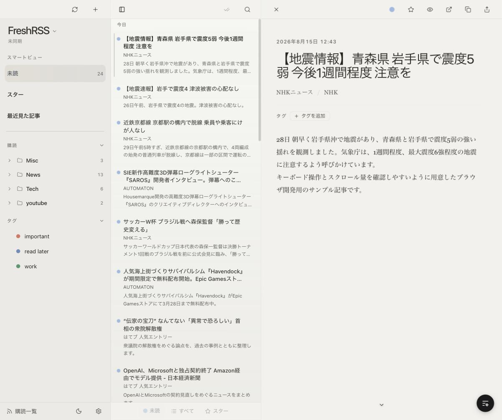
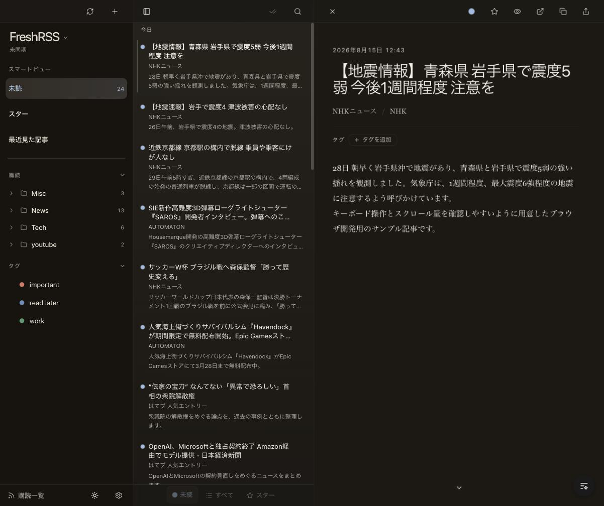

# Ultra RSS Reader

**A fast, keyboard-driven desktop RSS reader. Local-first, syncs with FreshRSS, and keeps your credentials in the OS keyring.**

[Download](#install) • [Features](#features) • [Keyboard Shortcuts](#keyboard-shortcuts) • [日本語](README.ja.md)

Dark theme

## Why Ultra RSS Reader?

- **Local-first, no account required** — All articles live in an embedded SQLite database on your machine. Full-text search (FTS5) works offline across everything you have ever fetched.
- **First-class FreshRSS sync** — Connect a FreshRSS server via the Google Reader API. Read status and stars sync bidirectionally, with pending local changes protected from being overwritten by stale remote state.
- **Credentials in the OS keyring** — Passwords and tokens go to Keychain / Credential Manager / Secret Service, never into the database.
- **Keyboard-driven** — `j`/`k` navigation, single-key actions, a `⌘K` command palette that jumps straight to any feed, and fully customizable bindings.
- **Read the real page without leaving** — Web Preview embeds the publisher page inside the reading flow with dedicated browser controls.

## Install

Download the latest installer from [**GitHub Releases**](https://github.com/jey3dayo/ultra-rss-reader/releases/latest):

| Platform | Artifact |
| --- | --- |
| macOS (Apple Silicon) | `.dmg` |
| Windows | `.exe` / `.msi` |

> **macOS note**: Releases are currently ad-hoc signed (no Apple Developer ID), so Gatekeeper will warn on first launch. Right-click the app → **Open**, or run `xattr -dr com.apple.quarantine "/Applications/Ultra RSS Reader.app"`.

To build from source instead, see [CONTRIBUTING.md](CONTRIBUTING.md).

## Features

- 📡 **Multiple providers** — Local RSS/Atom feeds and FreshRSS (Google Reader API)
- 🔍 **Full-text search** — SQLite FTS5 across all articles, instant and offline
- 🔄 **Sync** — Background periodic sync, sync-on-wake, manual trigger, and bidirectional pending mutations (read status, stars)
- 🗂️ **Folders & tags** — Organize feeds into folders, tag articles, mute keywords
- 🧭 **Command palette** — `⌘K` / `Ctrl+K`, type `@` to jump to any subscription
- 🌐 **Web Preview** — Embedded publisher pages with dedicated browser controls
- 🧹 **Subscription review** — A subscriptions index workspace that flags stale feeds and helps you decide Keep / Later / Unsubscribe
- 📥 **OPML** — Import and export feed lists
- ⚡ **Bionic reading** — Bold-emphasis rendering for faster reading
- 🎨 **Theming** — Light/dark with system detection, OKLch color tokens
- 🇯🇵 **Japanese localization** — In-app copy carefully tuned, not machine-translated
- 🔐 **Secure by default** — HTML sanitized in Rust before rendering; credentials never touch SQLite

## Keyboard Shortcuts

All bindings are customizable in Settings. Defaults:

| Key | Action | Key | Action |
| --- | --- | --- | --- |
| `j` / `k` | Next / previous article | `m` | Toggle read |
| `h` / `l` | Previous / next feed | `s` | Toggle star |
| `Space` / `Shift+Space` | Scroll article | `a` | Mark all read |
| `v` | Open in-app browser | `b` | Open external browser |
| `/` | Search | `f` | Cycle filter |
| `⌘1` / `⌘2` / `⌘3` | Unread / All / Starred | `u` | Focus sidebar |
| `⌘K` | Command palette | `⌘\` | Toggle sidebar |
| `Esc` | Close / clear | `⌘,` | Settings |

## Tech Stack

Tauri 2 (Rust) · React 19 · TypeScript · SQLite (rusqlite + FTS5) · Tailwind CSS v4 · Zustand + TanStack Query

See [CONTRIBUTING.md](CONTRIBUTING.md) for the full architecture, development modes, and verification commands.

## Contributing

Contributions are welcome. Start with [CONTRIBUTING.md](CONTRIBUTING.md) for setup (`mise install && pnpm install && mise run app:dev`), architecture, and quality gates. Operational docs live under [docs/](docs/README.md).

## License

[MIT](LICENSE)
